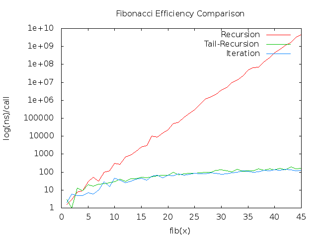

# lab-1
Here are three different version...

1. [recursion](lab-1/): Use `make` command to check the answer
2. [iteration](lab-1i/): Use `make` command to check the answer
3. [c-code](lab-1-c/): Translate arm code to c, and use `gprof` to analyze. You can use `make` to run the `gprof` script, the results will show in `analysis.txt`. After arranging the data, you can see the example in [result.txt](lab-1-c/result.txt). Finally, I use the [script](lab-1-c/gplot_cmd.txt) and the [result](lab-1-c/efficiency.png) shows as following...
```sh
gnuplot
> plot "analysis-result.txt"
> set style data lines                                           # connect each dots
> set grid                                                       # set background as grid
> set title "fib efficiency"                                     # add title
> replot
> plot "analysis-result.txt" using 1:2 title 'Recursion', \
       "analysis-result.txt" using 1:3 title 'Tail-Recursion', \    
       "analysis-result.txt" using 1:4 title 'Iteration'         # plot three data at the same time
> set logscale y; replot                                         # data in y-axis is large, use logscale
> set output "efficiency.png" ; set term png ; replot
```

